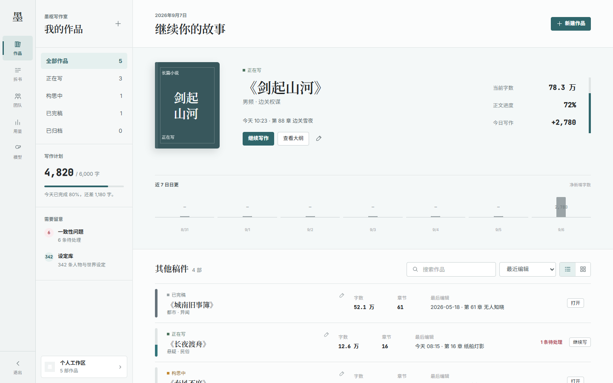
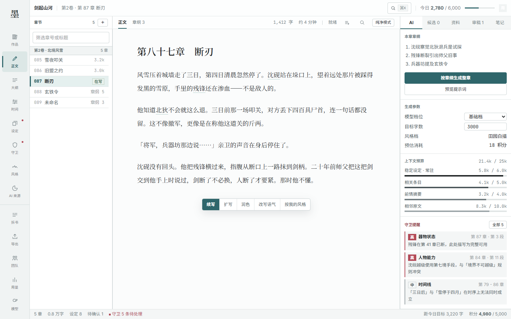
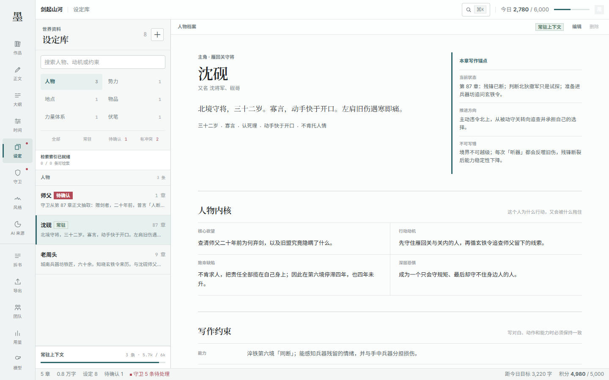
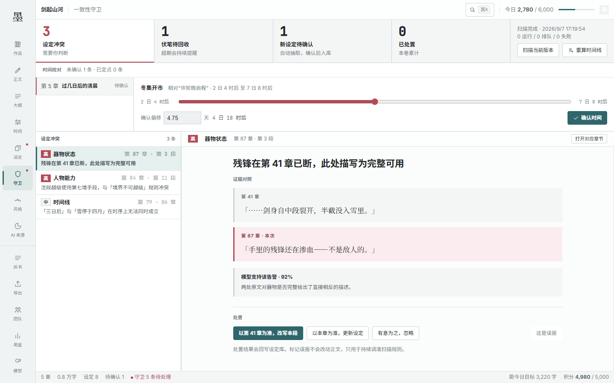
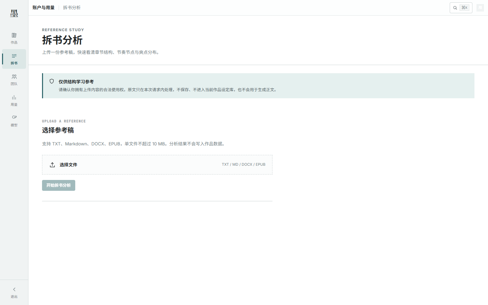
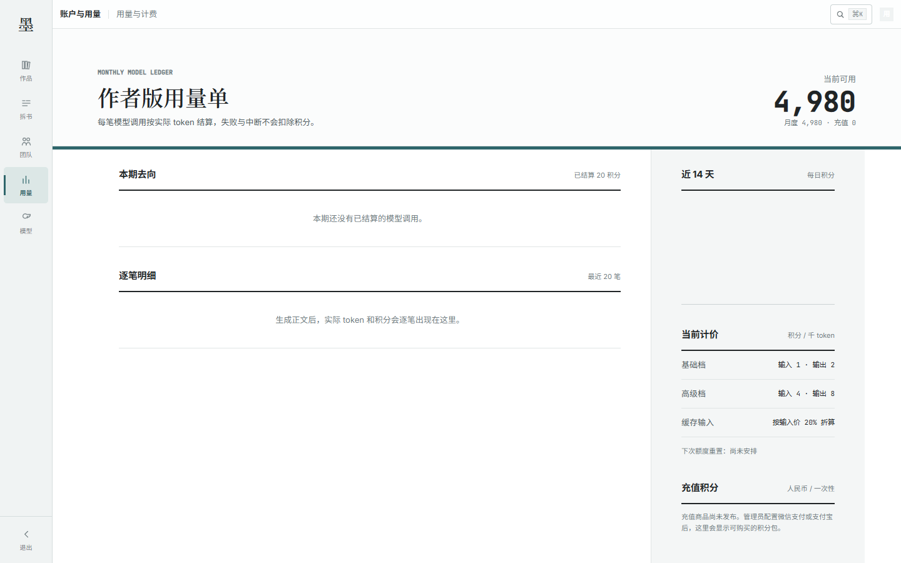

# 墨枢 · Moshu

> 面向长篇网文作者的 AI 创作工作台：把章纲、设定、正文和一致性证据放在同一个作品空间里。

墨枢的重点不是只生成一段文字，而是让长篇创作可以持续推进：按章节生成和采纳正文，用可追溯的设定、时间线与证据维持前后文一致，在作者确认前标出冲突和待处理线索。


## 核心能力

- **写作台**：章节正文、章纲、AI 草稿、风格档和上下文预算在同一工作区协同。
- **作品记忆**：人物、地点、势力、物品、伏笔和时间线按作品隔离，支持持续修改。
- **一致性守卫**：展示冲突两端的证据，支持回到正文处理，不让模型静默改写作者设定。
- **长文本基础设施**：PostgreSQL/pgvector 负责持久化与检索，Redis/Celery 承担异步分析和生成任务。

当前仓库包含 Vue 3 写作前端、FastAPI API、PostgreSQL/pgvector、Redis 与 Celery 异步任务，以及架构、计费和实现文档。

## 系统截图

以下截图来自本地 mock 前端，展示作品库、写作台、设定库、一致性守卫、拆书分析和用量页面的实际界面。

| 作品库 | 写作台 |
| --- | --- |
|  |  |

| 设定库 | 一致性守卫 |
| --- | --- |
|  |  |

| 拆书分析 | 用量与计费 |
| --- | --- |
|  |  |

## 仓库结构

```text
.
├── app/       Vue 3 + TypeScript + Tiptap 前端
├── server/    FastAPI + SQLAlchemy 后端骨架
├── docs/      架构与产品技术文档
├── _ds/       设计系统资源
└── LICENSE    项目使用许可
```

## 前端启动

```bash
cd app
cp .env.example .env
npm install
npm run dev
```

默认启用 mock API，可在没有后端的情况下浏览全部产品界面。测试和类型检查命令：

```bash
npm test
npm run typecheck
```

## 后端启动

后端要求 Python 3.12+，详细准备步骤见 `server/README.md`。

```bash
cd server
uv venv
uv pip install -e ".[dev]"
cp .env.example .env
uvicorn main:app --reload --port 8000
```

## 完整环境启动

准备好仅保存在本机的 `server/.env` 后，可在仓库根目录一次启动迁移、API、前端与异步任务：

```bash
docker compose up -d --build
```

- 前端：http://localhost:5180
- API 文档：http://localhost:8000/docs
- 就绪探针：http://localhost:8000/health/ready

`migration` 会在 API 和 worker 启动前执行 `alembic upgrade head`。就绪探针同时检查
PostgreSQL、Redis 与数据库迁移版本；任一项不满足就返回 503。

### 数据目录（Windows）

Compose 默认使用项目下的 `.docker-data` 目录作为开发兜底。部署前建议把数据放到非系统盘，
在项目根目录创建仅本机使用的 `.env`（不要提交），例如：

```dotenv
MOSHU_POSTGRES_DATA_DIR=<postgres-data-directory>
MOSHU_REDIS_DATA_DIR=<redis-data-directory>
```

这两个目录会以 bind mount 方式挂载，不使用 Docker Desktop 默认 named volume 位置。请按部署主机的操作系统填写实际目录，
目录需提前创建，并在 Docker Desktop 中共享对应位置。

## 核心约束

- 一章一文档，章节列表接口不返回正文。
- 单次生成上下文不超过 25k token。
- AI 流式输出先进入 `aiDraft`，采纳后才成为正文。
- 正文中的设定引用保存条目 ID，不保存显示名称。
- MVP 阶段不引入 Yjs；多人协作留到工作室阶段。

## 页面信息架构

页面分为全局层与项目层，项目层路由必须携带 `projectId`，禁止从作品库进入后继续读取上一部作品的数据。

| 层级 | 页面 | 职责 |
| --- | --- | --- |
| 全局 | `/` | 浏览、筛选和进入作品，不承载单部作品数据 |
| 全局 | `/projects/new` | 创建作品，确认骨架后进入该作品写作台 |
| 全局 | `/usage` | 账户套餐、积分与模型用量 |
| 项目 | `/projects/:projectId/outline` | 卷纲、章纲、时间线与节奏规划 |
| 项目 | `/projects/:projectId/codex` | 当前作品的人物、地点、势力、物品和伏笔设定 |
| 项目 | `/projects/:projectId/write` | 章节选择、正文编辑、AI 生成和引用设定 |
| 项目 | `/projects/:projectId/guard` | 当前作品的一致性、伏笔和待确认设定处置 |
| 项目 | `/projects/:projectId/style` | 为当前作品选择或管理作者风格档 |
| 项目 | `/projects/:projectId/ai-ratio` | 按本章或全书复核文字来源与疑似 AI 句式 |
| 项目 | `/projects/:projectId/export` | 导出当前作品正文、设定、大纲和自查报告 |

主要创作流程是：创建或选择作品 → 梳理大纲与设定 → 写作 → 一致性与 AI 痕迹复核 → 导出。写作、大纲和设定允许反复往返；守卫问题必须能跳回对应正文或时间线。账户用量不属于任何作品。

当前实现状态与后端验收记录见 `server/docs/IMPLEMENTATION_STATUS.md`；架构约束见 `docs/architecture/`。

## 许可

本项目采用保留所有权利（All Rights Reserved）许可，详见 [`LICENSE`](LICENSE)。除版权所有者书面授权外，不得复制、修改、再发布、销售或将本项目用于生产部署。第三方依赖仍受其各自许可证约束。
