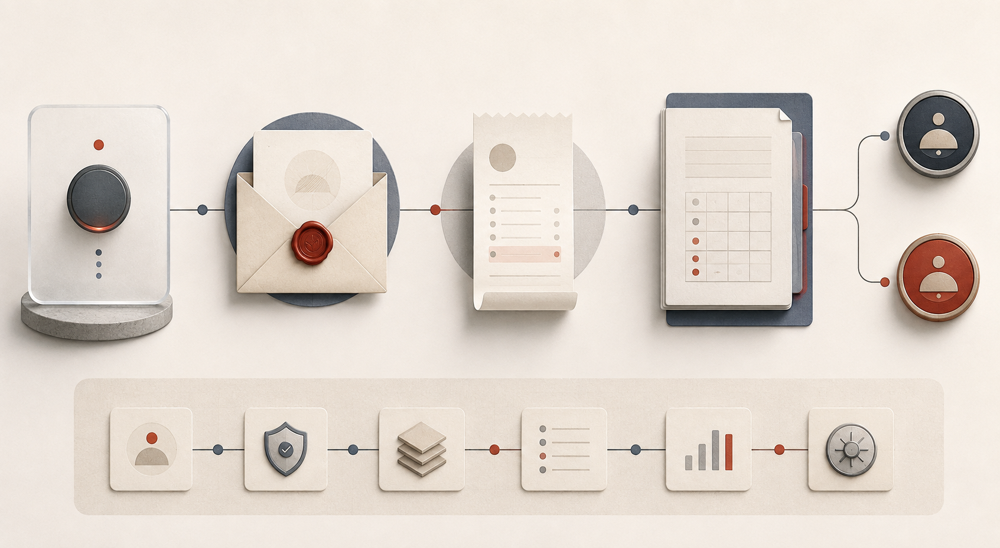

# 中国大陆收费接入边界

## 当前已完成

- 月度赠送额度和充值积分分开保存；月底重置不会覆盖充值余额。
- Token 预留、实际结算、失败退款继续复用 `UsageLog`。
- 充值商品、订单快照、权益授予、管理员商品上下架和 webhook 收件箱已经建模。
- 订单创建使用用户级幂等键；权益只能由一次“已支付”状态转换授予。
- `/billing/webhooks/{provider}` 在官方验签适配器未配置前固定返回 `503`，避免伪造回调铸造积分。

## 还需要商户侧配置

当前仓库没有也不应提交以下敏感资料：

- 微信支付商户号、AppID、API v3 Key、商户证书序列号、商户私钥文件
- 支付宝 AppID、应用私钥、支付宝公钥文件
- 对公网可访问的 HTTPS 回调地址

这些值通过 `server/.env` 和容器挂载的证书目录注入。仓库只保留变量名模板。

## 官方适配顺序

1. 开通微信支付 Native/JSAPI 与支付宝当面付/网页支付的正式或沙箱商户能力。
2. 选定并锁定官方维护的 Python SDK 版本，封装为 `PaymentProvider` 适配器；业务层只接收已验签的标准事件。
3. 微信回调验签并解密通知报文，支付宝回调验签并校验订单金额、币种和商户号。
4. 将标准事件写入 `billing_webhook_events`，按 `(provider, provider_event_id)` 幂等处理。
5. 只有订单金额、币种、商品快照全部匹配时，才调用 `mark_order_paid` 发放权益。
6. 补齐退款、拒付、对账和财务导出后再开放生产支付入口。

## 不做的事情

- 不自研银行卡/支付协议。
- 不相信前端“支付成功”页面作为到账依据。
- 不直接修改用户余额来处理退款；退款必须产生可审计的反向权益流水。
- 不把供应商密钥、私钥、证书或真实支付回调样本提交到 Git。
